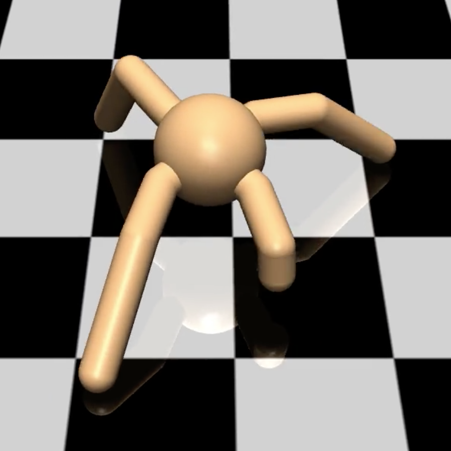
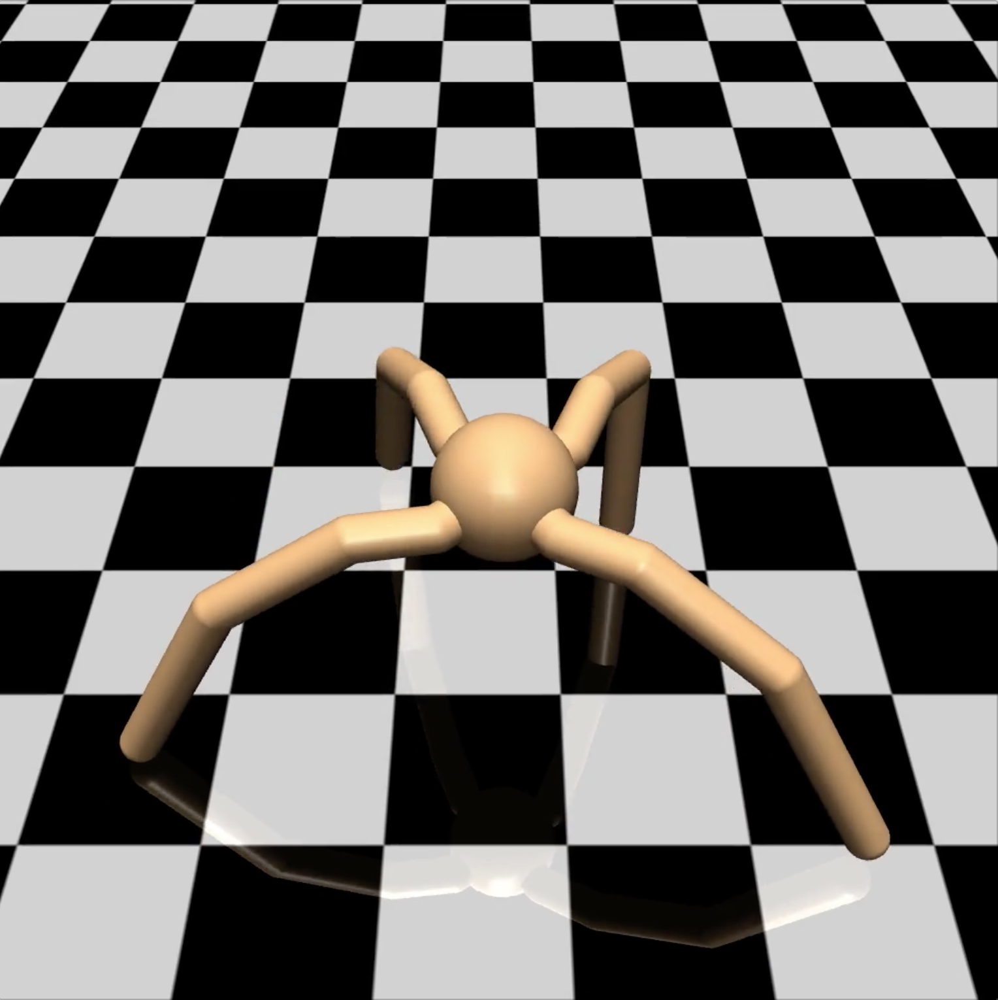
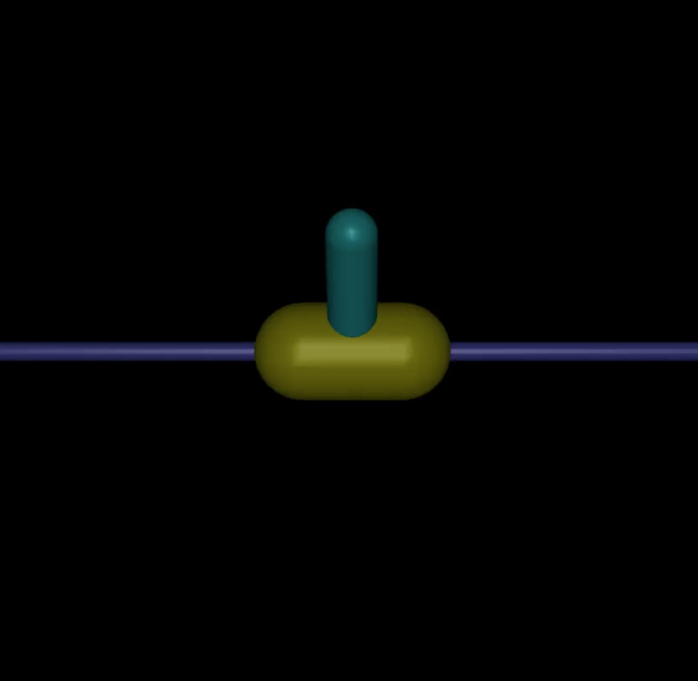
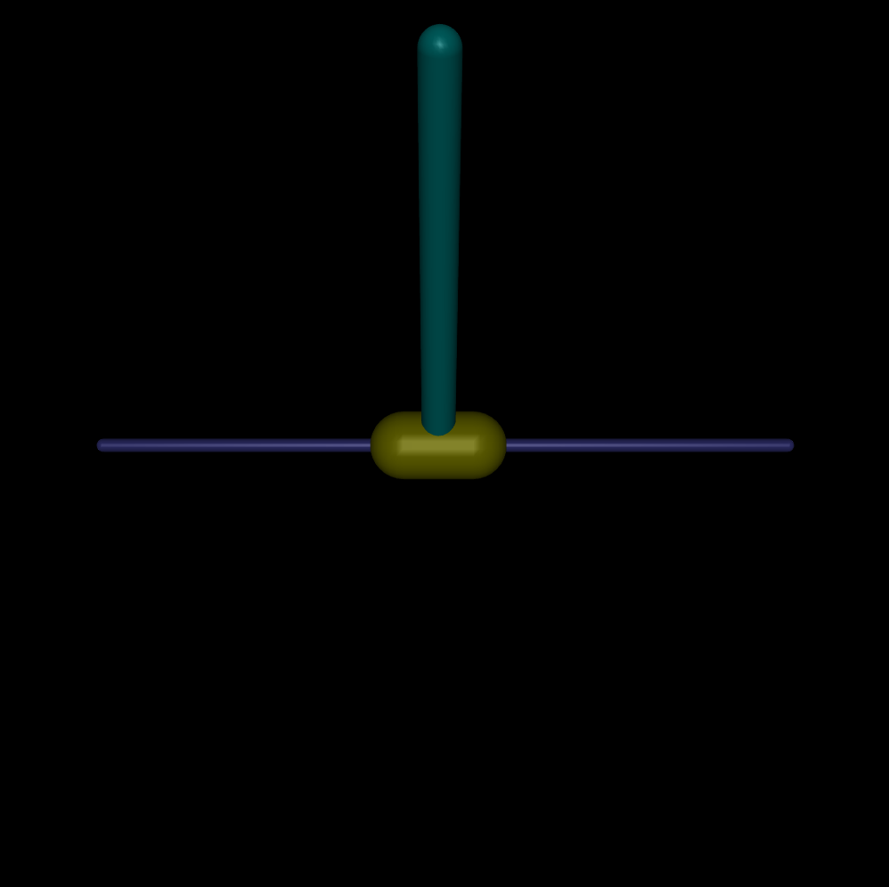
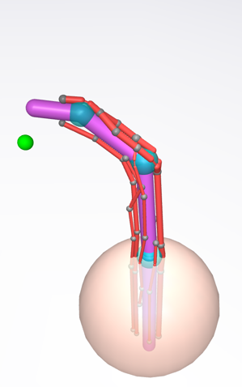

# mj_transfer
Additional MuJoCo environments for OpenAI Gym

## Install Instructions

1. Clone this folder.
2. Simply execute `python setup.py develop ` in this folder.
3. You can now `import mj_transfer` to register them, and `gym.make('BigAnt-v1')` if you want to use the BigAnt env.

## Available Environments

### AmputedAnt-v1
Like Ant-v1, but with one-quarter leg missing. 

### BigAnt-v1
Like Ant-v1, but with long legs. 

### ExtendedAnt-v1
Like Ant-v1, but with an additional joint on each limb.

### SmallInvertedPendulum-v1
Like InvertedPendulum, but with an arm half the size. 

### BigInvertedPendulum-v1
Like InvertedPendulum, but with an arm twice the size. 

### Finger-v1
A realistic tendon-driven finger.

# MuJoCo Tutorial
You can find a short tutorial for that explains the basics of MuJoCo there: [seba-1511.github.io/mj_transfer](seba-1511.github.io/mj_transfer)
