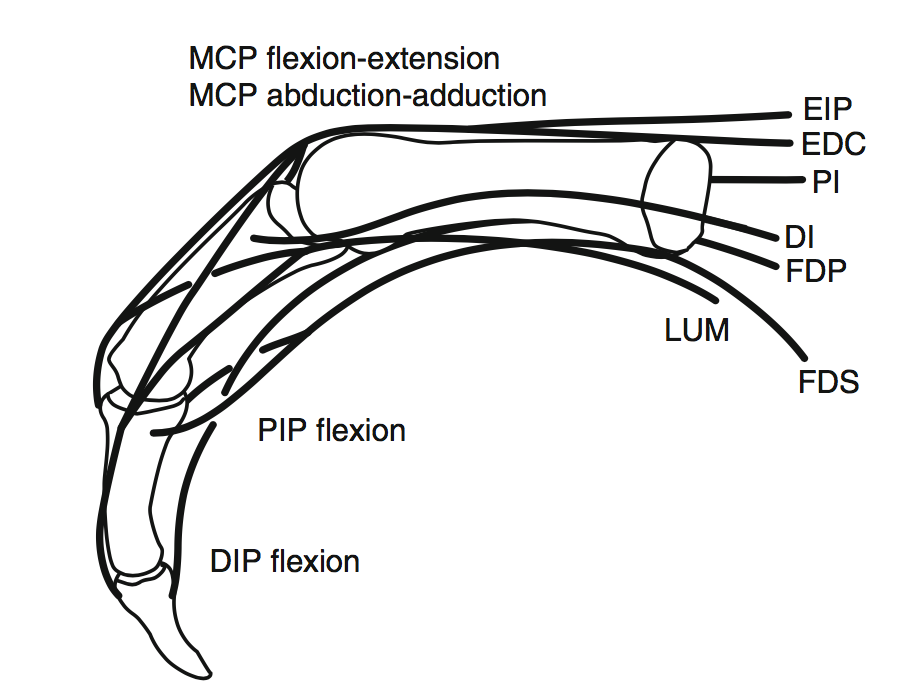

% Transfer Environments for MuJoCo
% Elizabeth Chu & Sebastien Arnold
% December 8, 2016

# MuJoCo and OpenAI Gym

MuJoCo stands for Multi-Joint Dynamics with Contact. MuJoCo is a physics engine that helps simulate multi-joint environments with contact forces. It also has a 3D graphics engine (with OpenGL backend) that renders the simulation in real-time. For more details, see: [http://www.mujoco.org/](http://www.mujoco.org/).

The [OpenAI Gym](https://gym.openai.com/) is an open-source project developed by the OpenAI group dedicated to providing a platform to host benchmarking environments for comparing machine learning algorithms. Currently it can be used with Python code and is compatible with numerical computation libraries such as TensorFlow or Theano. 

The OpenAI Gym contains a number of [pre-made MuJoCo environments](https://gym.openai.com/envs#mujoco) that users can use to test the efficacy of their algorithms. After [installing OpenAI Gym](https://gym.openai.com/docs) and [activating MuJoCo](https://www.roboti.us/license.html), you can quickly visualize the environments using this simple script:

~~~python

import gym

env = gym.make('InvertedPendulum-v1')
for i in xrange(10):
    env.reset()
    for i in xrange(1000):
        a = (np.random.rand(*env.action_space.shape) - 0.5) * 1.1
        # returns observation, reward, done, info
        o, r, d, i = env.step(a)  
        env.render()
~~~

# Extended Environments
In addition to the existing MuJoCo environments, we made some simple modifications on some existing environments to create extended environments. Each of these extended environments consist of: 1) an XML file, containing every object and their specifications in the environment; 2) A corresponding python file that defines the class and other parameters such as what happens on reset, rewards, and what marks a state as “done”. 

The motivation for extended environments was that, after training an agent for a particular environment, it was interesting to see whether the same agent would perform as well on highly similar environments. A description of each extended environment, followed by their screenshots, is provided below.

*   Small Inverted Pendulum (`SmallInvertedPendulum-v1`)
    * Extension of `InvertedPendulum-v1`.
    * Length of the pole is decreased by half (0.6 to 0.3).
    * The goal is to pull on the base of the pendulum with correct force so that the pole remains balanced.
*   Big Inverted Pendulum (`BigInvertedPendulum-v1`)
    * Similar to Small Inverted Pendulum, `BigInvertedPendulum*v1` has a longer pole.
*   Big Ant (`BigAnt-v1`)
    * Extension of `Ant-v1`.
    * Doubles the length of the limbs on ant. 
    * Each joint on the ant (8 total, 2 for each limb) is given an activation force.
    * The goal is to move the ant across the field to the right.
*   Amputed Ant (`AmputedAnt-v1`)
    * Extension of `Ant-v1`. Similar to `BigAnt-v1` in joint activation forces and goal of the environment.
    * Cuts off part of one limb (the right back leg) to 1/4 its original length (0.4 to 0.1).
*   Extended Ant (`ExtendedAnt-v1`)
    * Extension of `Ant-v1`.
    * Adds an extra section to each limb of ant. Ant originally has two sections (one joint) on each limb; now it has 3 sections. 
    * The first section’s length is 0.2, second section 0.4, third section 0.6.

            Environments 	                                         &nbsp;
        -------------------	                                    ----------------
{width=250px} 	 {width=250px}
{width=250px} 	                 {width=250px}
{width=250px} 	             {width=250px}

# Finger Environment
The finger environment (`Finger-v1`) is a special MuJoCo environment created specifically for this project. The environment consists of a palm, embodied in a sphere, and the index finger. A total of seven tendons connect to the proximal, middle, and distal phalanxes of the finger. Users can specify activation forces on the tendons which will pull on the finger and cause it to bend or flex. The tendons were chosen according to the finger model found in Valero-Cuevas’ book, “Fundamentals of Neuromechanics” [^valero-cuevas]. The figure is shown below.

Finger model from Valero-Cuevas | Simulated Finger Environment
--------------------------------|------------------------------
 | 

Screenshots of the finger environment are shown above. The goal of the finger is to touch a randomly positioned target ball with its fingertips. 

## XML Specifications for the Finger

In the MuJoCo XML hierarchy, objects grouped under another object (in the form of nested body elements) will move together unless there is a `joint` specified within the object. The joint allows motion degrees of freedom between the parent and child. The top-level body is special and is called `<worldbody>`. 

Objects in the finger environment are specified in the `<worldbody>` tag. The palm, embodied as a sphere, is named `finger_base`. The proximal phalanx is a child of `finger_base`, called `finger0`. They are connected through 2 joints on the x- and y-axis. The middle phalanx `finger1` is a child of `finger0`, and distal phalanx `finger2` child of `finger1`. They each contain one joint on the y-axis, allowing them only one degree of freedom, which is for bending forward. Connections between phalanxes are given names of the form `base_wrap` (between palm and finger base), `finger0_wrap` (between proximal and middle phalanxes), and `finger1_wrap` (between middle and distal phalanxes), simulating the appearance of a joint.

There is a `fingertip` sphere embedded at the fingertips, which are used for calculating rewards and determining whether or not the state can be considered “done” based on the distance between this fingertip sphere and the target sphere. To calculate the reward, we take the normal of the vector resulting from subtracting the target sphere’s position from fingertip’s position. When their distance is less than 0.2. 

The seven tendons of the finger are named: EIP, DI, PI, FDP, FDS, LUM, EDC. In MuJoCo, tendons are specified outside of the `<worldbody>`, under tag `<tendon>`. Each tendon has a `spatial` tag, which defines which geometry in the `<worldbody>` should be considered as part of this tendon. For example, to form a spatial tendon between the first and second “joints” (embodied as spheres), we define:

~~~
    <spatial name=”EIP” width=”0.03”>
        <geom geom=”base_wrap”>
        <geom geom=”finger0_wrap”>
    </spatial>
~~~

To make the tendon connect to specific points on the finger, we define a default dummy element in `<site>` under the `<default>` tag, before `<worldbody>`. Below, we specify that the default site should be a sphere of size 0.04. Then, in `<worldbody>`, whenever we define a site it will use the default `<site>` specifications. We define a number of these `site`s on various points along the finger body, especially around joints, to create the tendon. These sites are named `EIP_1`, `EIP_2`, ..., `EIP_7` and so on.

The sample XML code snippet below defines a tendon that connects the base joint to an arbitrary position on the finger:

~~~xml
    <site type=”sphere” size=”0.04”/>
    <worldbody>
        <body name=”finger_base” pos=”0 0 0”>
        <geom name=”base_wrap” type=”sphere” pos=”0 0 2” size=”0.17”/>
        <site name=”EIP_1” pos=”0.14 0.05 .3”/>
        ... etc.
    </worldbody>
    <tendon>
        <spatial name=”EIP” width=”0.02”>
            <geom geom=”finger_base”>
            <site site=”EIP_1”>
            ...
        </spatial>
~~~

For this finger, the EIP and LUM tendons each wrapped around 2 joints and contained 5 `site` elements. DI and PI each had 1 joint and 3 elements. The FDP had 3 joints and 7 `site`s. EDC and FDS both branched, wrapped around 3 joints, and contained more than 7 elements. For more documentation on MuJoCo XML files, see: [http://www.mujoco.org/book/modeling.html](http://www.mujoco.org/book/modeling.html). 

### Acknowledgements
We are grateful to the entire [BBDL Lab](http://valerolab.org) at USC for their help along the project. In particular, we thank Brian Cohn and Prof. Valero-Cuevas for their supervision. We would also like to thank Prof. Emo Todorov for his help on using tendons in MuJoCo.

[^valero-cuevas]: Valero-Cuevas, F.J. *Fundamentals of Neuromechanics.*  London: Springer, 2015.

